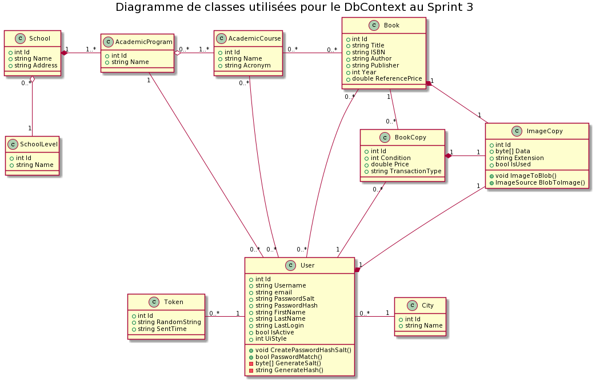
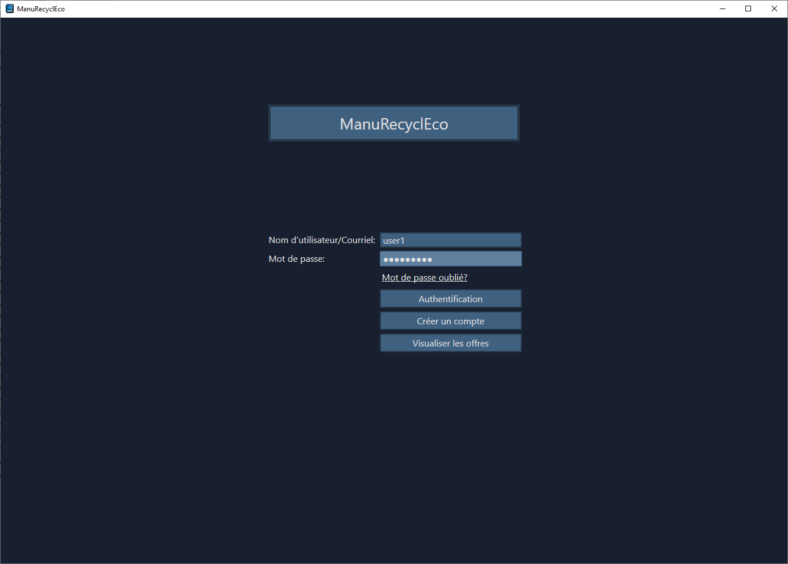
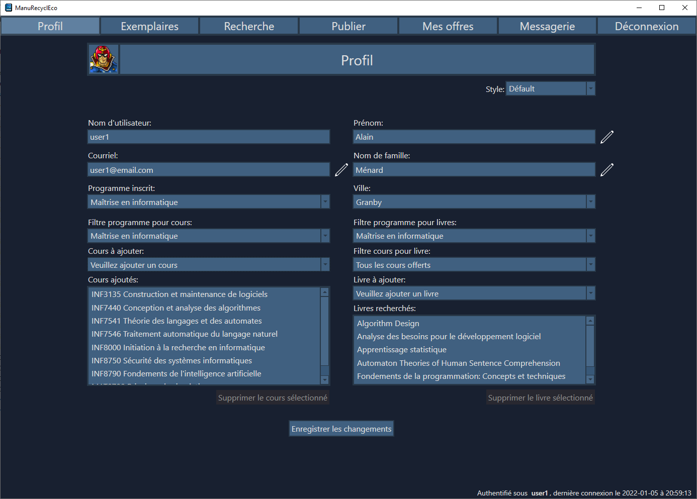
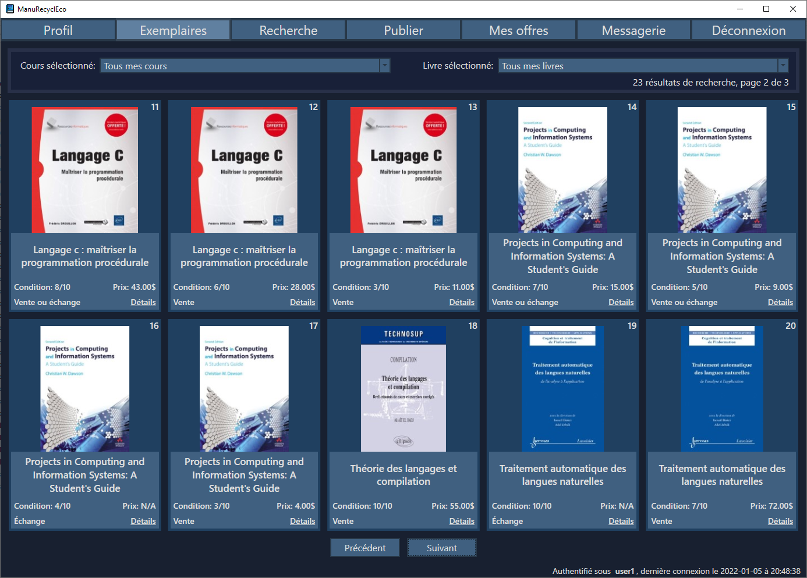
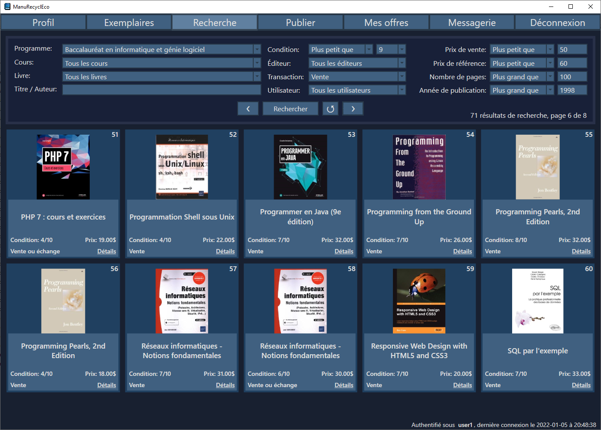
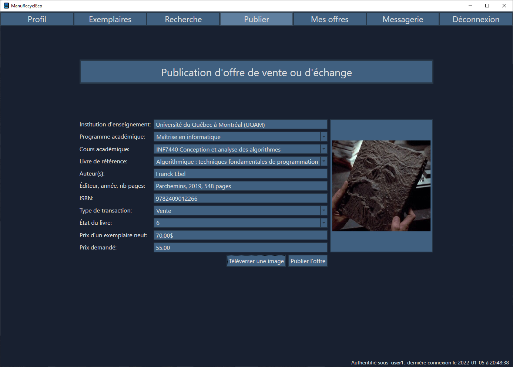
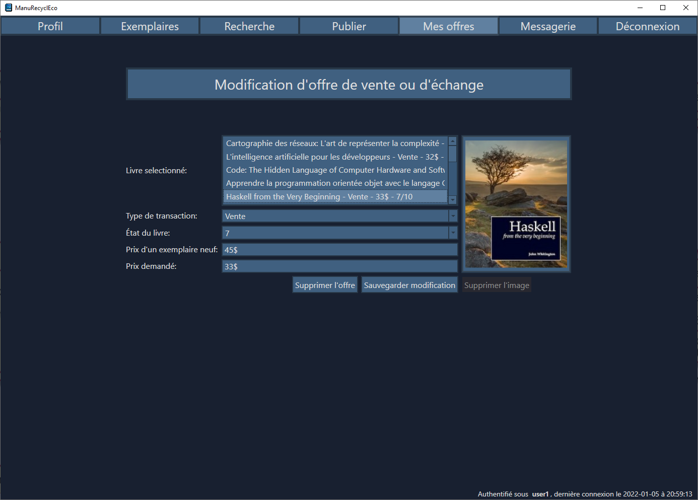
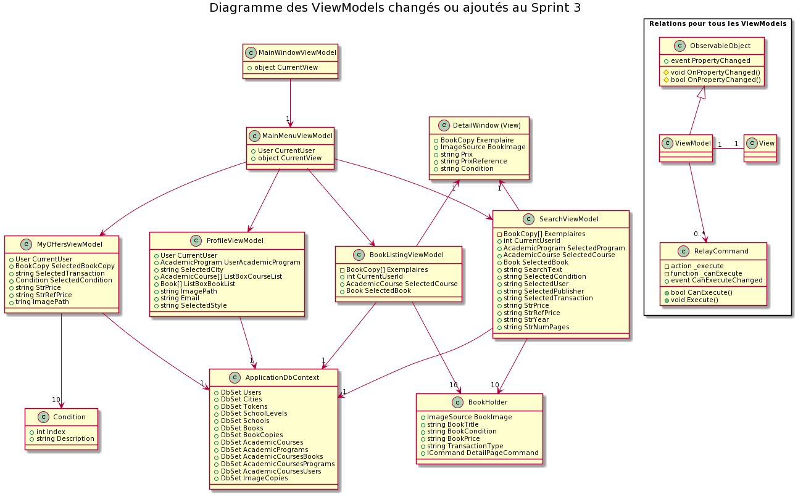

# ManuRecyclEco

## Présentation

ManuRecyclEco est un prototype de plateforme d'échange et de vente de manuels scolaires usagés crée par une équipe de trois étudiants de l'UQAM (dont moi) dans le cadre du cours [INM5151](https://etudier.uqam.ca/cours?sigle=INM5151) du Baccalauréat en informatique et génie logiciel. Le prototype a été codé en WPF/C# et il utilise le Entity Framework pour l'interaction avec la base de données SQLite. 

Bien que cela fut un projet d'équipe j'ai codé environ 60% à 70% du projet seul. Le prototype a été realisé en 3 sprints de 3 semaines chacun. Le code du dépôt montre l'avancement à la fin du 3e sprint. Le prototype comprend une page d'authetification, de création de compte, de réinitialisation de mot de passe, de profil, de recherche, de livre disponible pour les cours de l'étudiant, de publication d'offres et de modification des offres de l'usager. Ces pages seront décrites plus en détail dans les sections ci-dessous.

## Base de données

Une base de données test peut être crée avec le fichier `ApplicationDbContext.cs`. Elle comprends des usagers, des livres, des exemplaires, des cours, des programmes académiques. Les images de livres sont tirées du dossier `livres`. Il y a possibilité d'utiliser seulement certain livres aléatoirement ou bien le maximum de 93. De plus on peut générer un nombre au choix d'exemplaires pour ces livres et avoir des caractéristiques aléatoire pour ceux-cis tel le prix, l'état et le type de transaction recherché.

Voici le diagramme de classes utilisé par le Entity Framework pour la base de données:

## Authentification

## Profil de l'usager

## Exemplaires de cours

## Recherche d'exemplaires

## Publication d'offre

## Modification d'offres

## Relation entre les ViewModels

